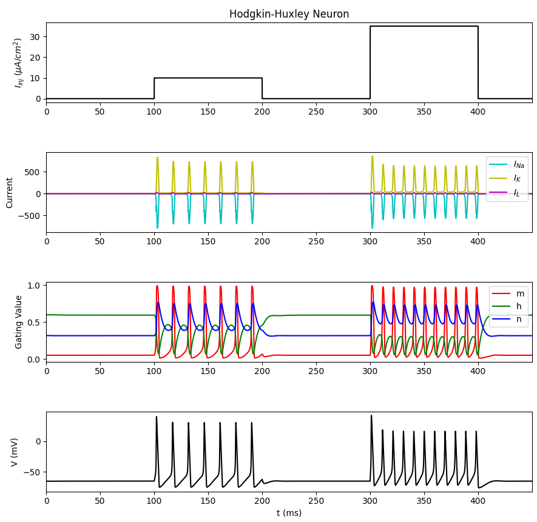
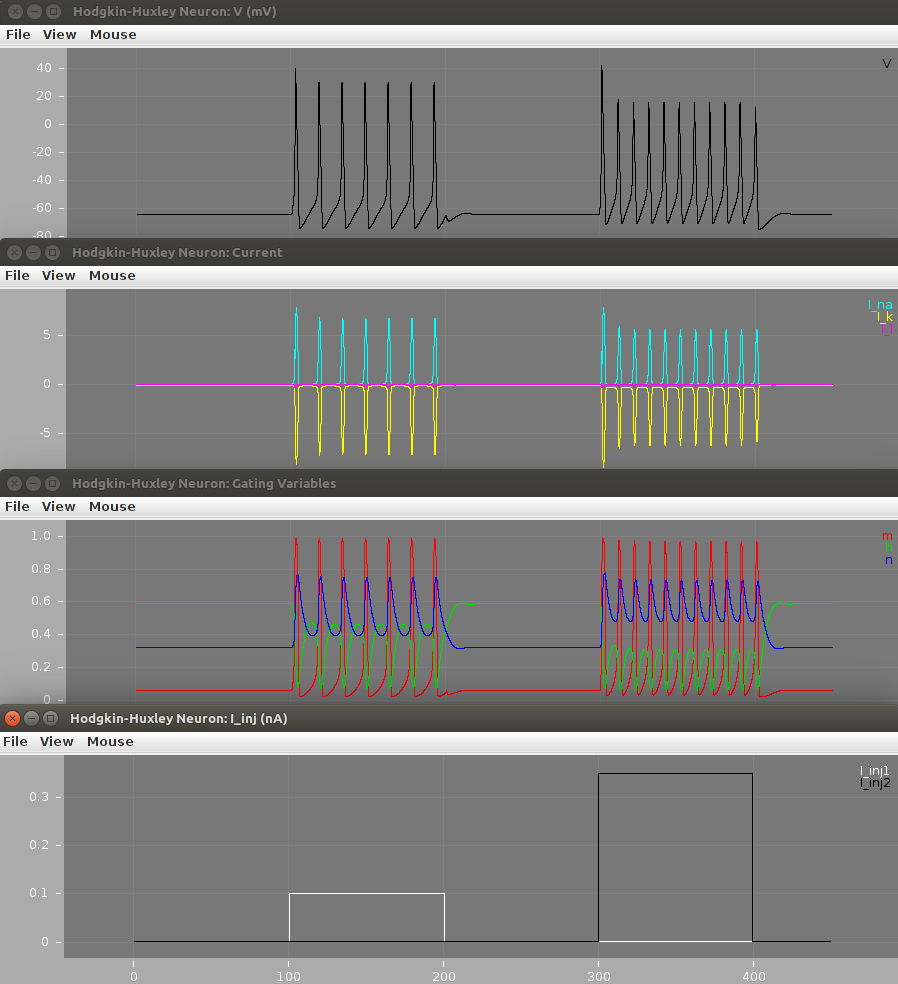

Implementation of HH Model in Python and NeuroML 2 
==================================================

In this section, we make line-by-line comparisons of the contents of the `HodgkinHuxley.py <Hodgkin%20Huxley.html>`_ python script and
the contents of the `NeuroML 2 files <Source.html>`_ and the related `LEMS_HH_Simulation.xml <LEMS_HH_Simulation.html>`_ LEMS file.

Installing the code
-------------------

You can either clone a local copy of this repository from GitHub using::
    
    git clone https://github.com/openworm/hodgkin_huxley_tutorial.git
    cd hodgkin_huxley_tutorial/Tutorial/Source
    
or just download `a zip file of the latest code <https://github.com/openworm/hodgkin_huxley_tutorial/archive/master.zip>`_, extract 
the contents and go to hodgkin_huxley_tutorial-master/Tutorial/Source/.

Running the model implementations
---------------------------------

To run the Python version::

    python HodgkinHuxley.py
    
To run the NeuroML 2 version on Linux/Mac::

    ./run.sh
    
or on Windows::

    run.bat
    
These both use the `bundled jar file <https://github.com/openworm/hodgkin_huxley_tutorial/blob/master/Tutorial/Source/jNeuroML-0.7.2-jar-with-dependencies.jar>`_
generated from `jNeuroML <https://github.com/NeuroML/jNeuroML>`_. Alternatively, you can install the latest `jNeuroML <https://github.com/NeuroML/jNeuroML>`_ 
or `pyNeuroML <https://github.com/NeuroML/pyNeuroML>`_ and use the corresponding command line utilities to run the model::
    
    jnml LEMS_HH_Simulation.xml
    pynml LEMS_HH_Simulation.xml
    
    

Membrane Capacitance
....................

This variable from `HodgkinHuxley.py <Hodgkin%20Huxley.html>`_:

.. literalinclude:: ../Source/HodgkinHuxley.py
   :language: python
   :lines: 8-9

Is used in this line in `hhcell.cell.nml <hhcell.html>`_:

.. literalinclude:: ../Source/hhcell.cell.nml
   :language: xml
   :lines: 37

You can `read more about the capacitance of a membrane <http://www.scholarpedia.org/article/Electrical_properties_of_cell_membranes#Capacitance>`_.

Sodium (Na) Ion Channel Variables
.................................

These variables from `HodgkinHuxley.py <Hodgkin%20Huxley.html>`_:

.. literalinclude:: ../Source/HodgkinHuxley.py
   :language: python
   :lines: 11-12

.. literalinclude:: ../Source/HodgkinHuxley.py
   :language: python
   :lines: 20-21

Are used in this line in `hhcell.cell.nml <hhcell.html>`_:

.. literalinclude:: ../Source/hhcell.cell.nml
   :language: xml
   :lines: 33

You can `read more about the maximum conductance and reversal potential (zero-current potential) of an ion channel <http://www.scholarpedia.org/article/Ion_channels#Bioelectricity_results_from_currents_in_ion_channels>`_.

Potassium (K) Ion Channel Variables
...................................

These variables from `HodgkinHuxley.py <Hodgkin%20Huxley.html>`_:

.. literalinclude:: ../Source/HodgkinHuxley.py
   :language: python
   :lines: 14-15

.. literalinclude:: ../Source/HodgkinHuxley.py
   :language: python
   :lines: 23-24

Are used in this line in `hhcell.cell.nml <hhcell.html>`_:

.. literalinclude:: ../Source/hhcell.cell.nml
   :language: xml
   :lines: 34

You can `read more about the maximum conductance and reversal potential (zero-current potential) of an ion channel <http://www.scholarpedia.org/article/Ion_channels#Bioelectricity_results_from_currents_in_ion_channels>`_.

Passive Leak Channel Variables
..............................

These variables from `HodgkinHuxley.py <Hodgkin%20Huxley.html>`_:

.. literalinclude:: ../Source/HodgkinHuxley.py
   :language: python
   :lines: 17-18

.. literalinclude:: ../Source/HodgkinHuxley.py
   :language: python
   :lines: 26-27

Are used in this line in `hhcell.cell.nml <hhcell.html>`_:

.. literalinclude:: ../Source/hhcell.cell.nml
   :language: xml
   :lines: 32

You can `read more about the maximum conductance and reversal potential (zero-current potential) of an ion channel <http://www.scholarpedia.org/article/Ion_channels#Bioelectricity_results_from_currents_in_ion_channels>`_.

Time of Simulation
..................

This variable from `HodgkinHuxley.py <Hodgkin%20Huxley.html>`_:

.. literalinclude:: ../Source/HodgkinHuxley.py
   :language: python
   :lines: 29-30

Is used in this line in `LEMS_HH_Simulation.xml <LEMS_HH_Simulation.html>`_:

.. literalinclude:: ../Source/LEMS_HH_Simulation.xml
   :language: xml
   :lines: 25

This specifies that the simulation should run for 450 milliseconds and use a step size for integration of 0.01 milliseconds.

Input Current / Input Current Density
.....................................

The method from `HodgkinHuxley.py <Hodgkin%20Huxley.html>`_ takes the input in as a current density in the form of uA/cm^2.  NeuroML/LEMS uses an input current in the form of nA, which requires a conversion in the input values.

This method from `HodgkinHuxley.py <Hodgkin%20Huxley.html>`_:

.. literalinclude:: ../Source/HodgkinHuxley.py
   :language: python
   :pyobject: HodgkinHuxley.I_inj
   :linenos:

By using a given surface area of 1000.0 um^2 in the cell, it makes the conversion from uA/cm^2 to nA easier.

.. math::

   Surface Area = 4 * pi * (radius)^2 = 4 * pi * (diameter / 2)^2 = 4 * pi * (17.841242 / 2)^2 = 4 * pi * (8.920621)^2 = 1000 um^2

.. literalinclude:: ../Source/hhcell.cell.nml
   :language: xml
   :lines: 17-20

Given a surface area of 1000.0 um^2 in the cell the following equation is used to convert from X uA/cm^2 to Y nA:

.. math::

   (X  uA/cm^2) * (1000.0  um^2) * (1000  nA/uA) / (1 * 10^8  um^2/cm^2) = Y nA

Line 11 can then be translated into the delay, duration and amplitude of the two pulseGenerator objects in `HHCellNetwork.net.nml <HHCellNetwork.html>`_:

.. literalinclude:: ../Source/HHCellNetwork.net.nml
   :language: xml
   :lines: 13-14

Channel Gating Kinetics for Sodium (Na) Channel m
.................................................

m is the activation variable for the Sodium (Na) Channel.

The function that governs the activation of this channel is based on the overall
membrane voltage, because the channel opens and closes based on detecting the membrane potential.

You can `read more about these variables <https://en.wikipedia.org/wiki/Hodgkin%E2%80%93Huxley_model#Voltage-gated_ion_channels>`_.

These methods from `HodgkinHuxley.py <Hodgkin%20Huxley.html>`_:

.. literalinclude:: ../Source/HodgkinHuxley.py
   :language: python
   :pyobject: HodgkinHuxley.alpha_m
   :linenos:

.. literalinclude:: ../Source/HodgkinHuxley.py
   :language: python
   :pyobject: HodgkinHuxley.beta_m
   :linenos:

Are used in these lines in `naChan.channel.nml <naChan.html>`_:

.. literalinclude:: ../Source/naChan.channel.nml
   :language: xml
   :lines: 13-16

Channel Gating Kinetics for Sodium (Na) Channel h
.................................................

h is the inactivation variable for the Sodium (Na) Channel.  Inactivation is a
different state than not being activated, which is called "deactivated".  You can
`read more about how Sodium channel gating works <https://en.wikipedia.org/wiki/Sodium_channel#Gating>`_.

The function that governs the activation of this channel is based on the overall
membrane voltage, because the channel opens and closes based on detecting the membrane potential.

You can `read more about these variables <https://en.wikipedia.org/wiki/Hodgkin%E2%80%93Huxley_model#Voltage-gated_ion_channels>`_.

These methods from `HodgkinHuxley.py <Hodgkin%20Huxley.html>`_:

.. literalinclude:: ../Source/HodgkinHuxley.py
   :language: python
   :pyobject: HodgkinHuxley.alpha_h
   :linenos:

.. literalinclude:: ../Source/HodgkinHuxley.py
   :language: python
   :pyobject: HodgkinHuxley.beta_h
   :linenos:

Are used in these lines in `naChan.channel.nml <naChan.html>`_:

.. literalinclude:: ../Source/naChan.channel.nml
   :language: xml
   :lines: 18-21

Channel Gating Kinetics for Potassium (K) channel n
...................................................

n is the activation variable for the Potassium (K) Channel.  The potassium channel does not inactivate, so there is no inactivation variable.

The function that governs the activation of this channel is based on the overall
membrane voltage, because the channel opens and closes based on detecting the membrane potential.

You can `read more about these variables <https://en.wikipedia.org/wiki/Hodgkin%E2%80%93Huxley_model#Voltage-gated_ion_channels>`_.

These methods from `HodgkinHuxley.py <Hodgkin%20Huxley.html>`_:

.. literalinclude:: ../Source/HodgkinHuxley.py
   :language: python
   :pyobject: HodgkinHuxley.alpha_n
   :linenos:

.. literalinclude:: ../Source/HodgkinHuxley.py
   :language: python
   :pyobject: HodgkinHuxley.beta_n
   :linenos:

Are used in these lines in `kChan.channel.nml <kChan.html>`_:

.. literalinclude:: ../Source/kChan.channel.nml
   :language: xml
   :lines: 13-16

Initial Values
..............

This line from `HodgkinHuxley.py <Hodgkin%20Huxley.html>`_:

.. literalinclude:: ../Source/HodgkinHuxley.py
   :language: python
   :lines: 124

Is used to define the initial values for the model in `hhcell.cell.nml <hhcell.html>`_:

.. literalinclude:: ../Source/hhcell.cell.nml
   :language: xml
   :lines: 38

The values for m, h, n at t=0 in LEMS/NML2 are worked out as the steady state values (inf)
of each activation variable for the given initial membrane potential.
See `here <http://www.neuroml.org/NeuroML2CoreTypes/Channels.html#gateHHrates>`_
for the NML2 implementation (see On Start).

You could refactor the script to do this too by introducing tau_m() and inf_m()
and using alpha_m etc., change the expressions for dmdt etc. (e.g. dm/dt = (inf_m - m) / tau_m) etc. and::

  V_init = -65
  X = odeint(self.dALLdt, [V_init, m_inf(V_init), h_inf(V_init), n_inf(V_init)], self.t, args=(self,))

Plots
.....

This line in `HodgkinHuxley.py <Hodgkin%20Huxley.html>`_:

.. literalinclude:: ../Source/HodgkinHuxley.py
   :language: python
   :lines: 135-138

Is used in these lines in `LEMS_HH_Simulation.xml <LEMS_HH_Simulation.html>`_:

.. literalinclude:: ../Source/LEMS_HH_Simulation.xml
   :language: xml
   :lines: 27-29

This line in `HodgkinHuxley.py <Hodgkin%20Huxley.html>`_:

.. literalinclude:: ../Source/HodgkinHuxley.py
   :language: python
   :lines: 140-145

Is used in these lines in `LEMS_HH_Simulation.xml <LEMS_HH_Simulation.html>`_:

.. literalinclude:: ../Source/LEMS_HH_Simulation.xml
   :language: xml
   :lines: 37-41

This line in `HodgkinHuxley.py <Hodgkin%20Huxley.html>`_:

.. literalinclude:: ../Source/HodgkinHuxley.py
   :language: python
   :lines: 147-152

Is used in these lines in `LEMS_HH_Simulation.xml <LEMS_HH_Simulation.html>`_:

.. literalinclude:: ../Source/LEMS_HH_Simulation.xml
   :language: xml
   :lines: 31-35

This line in `HodgkinHuxley.py <Hodgkin%20Huxley.html>`_:

.. literalinclude:: ../Source/HodgkinHuxley.py
   :language: python
   :lines: 154-158

Is used in these lines in `LEMS_HH_Simulation.xml <LEMS_HH_Simulation.html>`_:

.. literalinclude:: ../Source/LEMS_HH_Simulation.xml
   :language: xml
   :lines: 43-46
   
   
Output of simulations
.....................

After running the scripts the output figures should look like the ones below.

For: *python HodgkinHuxley.py*

For: *run.sh* (or *run.bat* on Windows)

Check out `the electrophysiology part of this tutorial <Electrophysiology.html#plots>`_
for an explanation of these plots.

