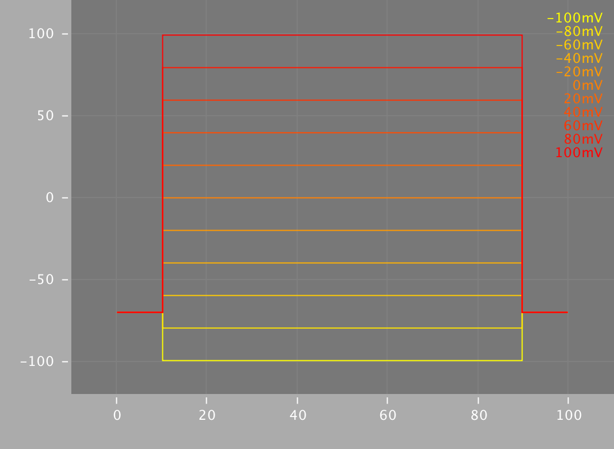
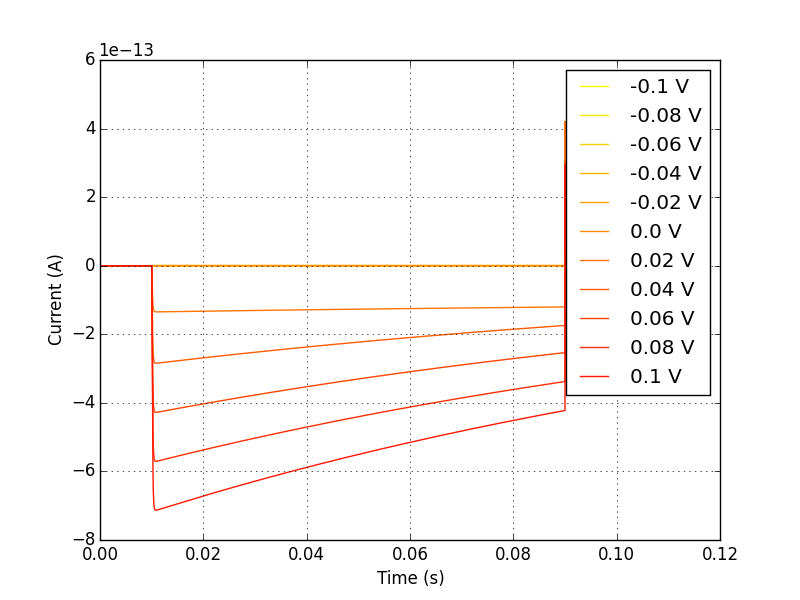
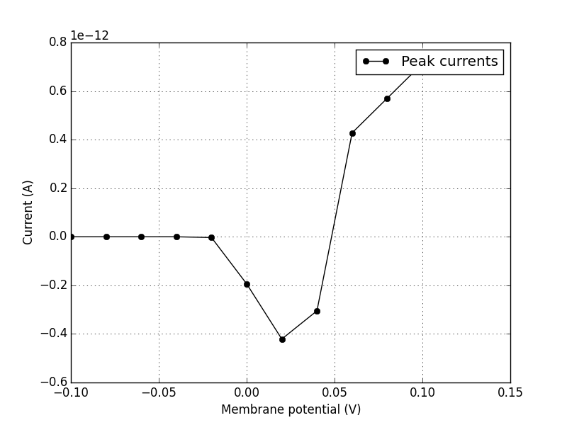
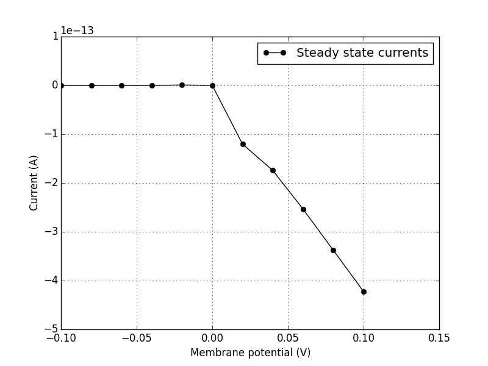

Current-voltage characteristic
==================================

The current through an electronic component, with the corresponding 
potential difference (voltage) across it is called the 
`current-voltage characteristic <https://en.wikipedia.org/wiki/Current%E2%80%93voltage_characteristic>`_.

This relationship is usually represented with an I/V curve, which is 
just that: a plot of current versus voltage.

This property is one characteristic used to when examining the 
behaviour of electonic circuits. Given the electronic-biological 
equivalence `discussed earlier <Electrophysiology.html>`_, it is 
easy to see how this property would also be useful in defining 
the behaviour of excitable membranes and their embedded ion channels.

The patch-clamp protocol
------------------------

In a patch-clamp experiment, a piece of membrane is sealed off from its
surrounding environment, such that there is almost no influence of external
electrochemical process on what is happening in this small "patch" of 
membrane.

By applying a voltage through this membrane patch, almost perfect
control of the membrane potential can be obtained. In this way, an
experimenter can hold the membrane at various voltages (fig. 1) and 
observe the current response that occurs (fig. 2).

    Fig. 1

    Voltage stepping in a patch-clamp protocol. Electrical potential
    applied across a patch of membrane, holding the membrane at that
    potential.

    Fig. 2

    Current-time plot for a voltage-clamped membrane patch. This 
    represents the current change over time in response to voltage 
    clamping.

---------

Making I/V plots
----------------

With this data, we can now plot a current-voltage relationship, to help
us characterize and model the electrophysiological behaviour of the 
patch of membrane. 

We will consider two types of I/V curves here. The first is the so-called
"peak" I/V curve, where the largest current magnitude produced at each voltage
step is plotted against the voltage that produced it. We can see an 
example of this in figure 3.

The second type of I/V curve is called a "steady-state" I/V curve, and
is a representation of the somewhat leveled out current at the end of 
each voltage step, again plotted against the voltage step that produced
it. See figure 4 for an example of this type of I/V plot.

    Fig. 3

    Peak I/V Curve. Plotting the maximum current at each voltage step 
    produces a curve like this.

    Fig. 4

    Steady-state I/V curve. Plotting the current at the end of each 
    voltage step gives us a curve similar to this one.

-----------

How does current even flow across the membrane?
^^^^^^^^^^^^^^^^^^^^^^^^^^^^^^^^^^^^^^^^^^^^^^^

In the `electrophysiology <Electrophysiology.html>`_ section we looked
at how voltage-gated ion channels influence the kinetics of excitable
cells. It is this behaviour that we are closely examining here, by 
holding the membrane potential at a particular level and observing
what happens to ion flow (current) across the membrane.

If we patch-clamp a larger piece of membrane, there will be many ion 
channels exerting their effect. Technology now exists, however, that
allows electrophysiologists to patch-clamp a *single* ion channel and 
perform the same experiments. In this way, it is possible to obtain 
data about individual ion channel types, and characterize their kinetics
using I/V curves.

The above figures are all examples of this type of ion channel patch
clamping. 

Using code to produce these plots
---------------------------------

At the risk of losing your trust, it must be admitted that the plots
above were not actual biological recordings, but were instead 
generated by *simulating* a single ion channel patch-clamp experiment.

Using a `NeuroML2 model of an ion channel <https://github.com/VahidGh/ChannelWorm/blob/8e0daf66e0070c6760c26d4c27d9dec525a0ac12/models/Cav1.channel.nml>`_
and a suite of virtual electrophysiology tools (`pyNeuroML <https://github.com/NeuroML/pyNeuroML>`_), you 
can produce this set of curves, and a similar characterization for any 
number of ion channel models that exist.

First, make sure you have the latest version of pyNeuroML installed.
Jump over to that project's `installation instructions <https://github.com/NeuroML/pyNeuroML#installation>`_ to get up
and running.

Now, by doing the set of commands below in your shell, you should be presented
with the same set of plots we have been usign in this tutorial.

.. code:: bash

    # grab a sample channel model
    wget https://goo.gl/yrAfhn -O Cav1.channel.nml 

    # analyse it
    pynml-channelanalysis -ivCurve Cav1.channel.nml 

