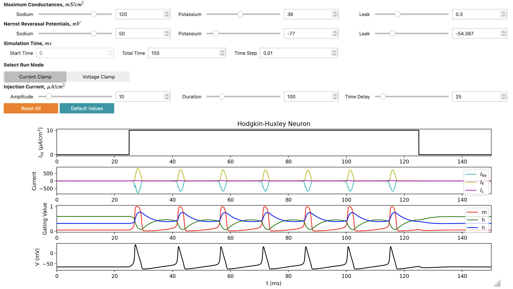

## Jupyter notebook for the Hodgkin Huxley model

This is an interactive web notebook using [Jupyter technologies](https://jupyter.org/) which can be used to run the HH model, change the parameters of the model and display the dynamical properties of variables.

<kbd></kbd>

This notebook was developed as part of [Google Summer of Code 2022 by Rahul Sonkar](notebooks/GSoC_2022_Submission/GSoC_Documentation.md).

## Running the notebook

### Option 1) Using Open Source Brain version 2

*Advantage: you can save any changes you make to the notebook in your [OSBv2 workspace](https://docs.opensourcebrain.org/OSBv2/Overview.html)*

Go to https://v2.opensourcebrain.org/repositories/33. Click on **Create a new Workspace**.

### Option 2) Using Binder

*Advantage: quick to start & run, no login required*

The notebook can also be opened using [Binder](https://mybinder.org/). Click here to open the HH notebook: 
