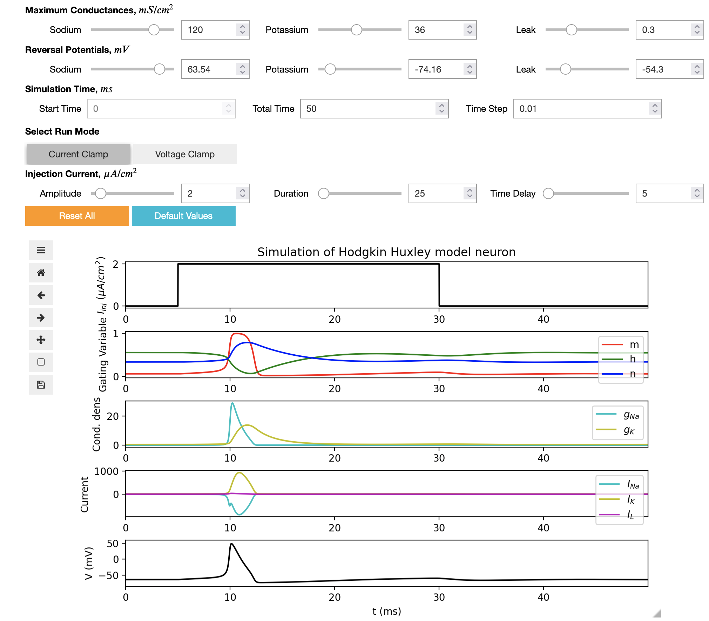

## Jupyter notebook for the Hodgkin Huxley model

This is an interactive web notebook using [Jupyter technologies](https://jupyter.org/) which can be used to run the HH model, change the parameters of the model and display the dynamical properties of variables.

<kbd></kbd>

This notebook was developed as part of [Google Summer of Code 2022 by Rahul Sonkar](notebooks/GSoC_2022_Submission/GSoC_Documentation.md).

## Running the notebook

### Option 1) Using Open Source Brain version 2

*Advantage: you can save any changes you make to the notebook in your [OSBv2 workspace](https://docs.opensourcebrain.org/OSBv2/Overview.html), and view/edit other files associated with the model including the [Python implementation of the HH model](https://github.com/openworm/hodgkin_huxley_tutorial/blob/master/Tutorial/Source/HodgkinHuxley.py).*

- Go to [Open Source Brain v2](https://v2.opensourcebrain.org) and [register for a new account](https://docs.opensourcebrain.org/OSBv2/Guided_tour.html#register-sign-in-to-osbv2) and log in.
- Go to the Hodgkin Huxley model repository page at https://v2.opensourcebrain.org/repositories/33.
- Click on **Create a new Workspace**.
- When this has been created, go to the new workspace page and click on **Open with JupyterLab**.
- This opens a copy of all the files in the repository in [JupyterLab](https://docs.opensourcebrain.org/OSBv2/JupyterLab.html#osbv2-applications-jupyterlab).
- In the left had file browser navigate to the folder `Hodgkin Huxley Tutorials/master/notebooks/Python_HH_version` and double click on `Python_Notebook_HH.ipynb` to open the notebook.
- You should be able to run the interactive widget by click the double arrow (&#9654;&#9654;) in the JupyterLab toolbar at the top of the notebook. 

### Option 2) Using Binder

*Advantage: quick to start & run, no login required*

The notebook can also be opened using [Binder](https://mybinder.org/). Click here to open the HH notebook: 
